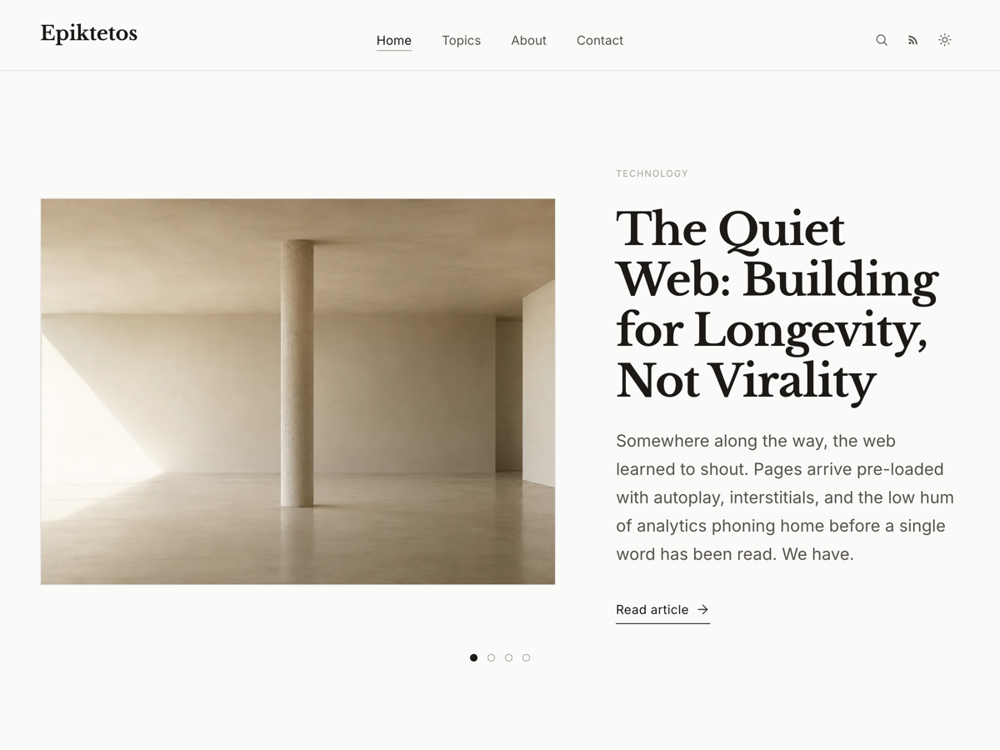

# Epiktetos

Epiktetos is a WordPress block theme for editorial sites, essays, journals, and personal publications. It focuses on readable typography, native WordPress patterns, accessible navigation, dark mode, and a calm reader experience.

## Key Features

- Block theme built for WordPress full site editing.
- Accessible landmarks, navigation states, keyboard focus styles, and semantic templates.
- Dark mode support using theme tokens and native preferences.
- Reader-focused single post experience with reading progress, table of contents, related articles, and discussion styling.
- Optional Article Voiceover for single posts, using audio selected from the WordPress Media Library.
- Editorial archive, category, tag, author, search, about, contact, and static page templates.
- Responsive layouts for desktop, tablet, and mobile reading.
- Native WordPress menus, templates, settings, and taxonomy behavior.
- SEO-oriented metadata, structured publication details, and clean document hierarchy.
- Performance-conscious asset loading with no unnecessary external libraries.

## Theme Highlights

Epiktetos includes publication-style home sections, category and topic discovery, polished archive rows, author pages, newsletter and reader calls to action, configurable theme settings, and bundled Sample Content for local setup and review.

The theme is intentionally restrained. It avoids heavy visual effects, page-builder dependencies, and non-native layout systems.

## Installation

1. Download or clone this repository.
2. Copy `wordpress/wp-content/themes/epiktetos` into your WordPress installation's `wp-content/themes` directory.
3. In the WordPress admin, go to **Appearance > Themes**.
4. Activate **Epiktetos**.
5. Configure menus, homepage settings, and theme options from the WordPress admin, or create the bundled Sample Content from **Appearance > Epiktetos > Sample Content**.

## Requirements

- WordPress 6.5 or later.
- PHP 8.0 or later.
- A modern browser with support for current CSS layout features.

## Documentation

Documentation is available at:

[https://docs.mcorucu.com/epiktetos-theme/](https://docs.mcorucu.com/epiktetos-theme/)

## GitHub Repository

[https://github.com/mcorucu/epiktetos-wordpress-theme](https://github.com/mcorucu/epiktetos-wordpress-theme)

## Issue Tracker

Please report bugs and reproducible issues at:

[https://github.com/mcorucu/epiktetos-wordpress-theme/issues](https://github.com/mcorucu/epiktetos-wordpress-theme/issues)

## Screenshots

The WordPress theme screenshot is included at:

`wordpress/wp-content/themes/epiktetos/screenshot.png`

## License

Epiktetos is licensed under the GNU General Public License v2 or later. See [LICENSE](LICENSE) for details.

Bundled fonts are licensed under the SIL Open Font License 1.1. See `wordpress/wp-content/themes/epiktetos/assets/fonts/LICENSE.md`.

## Contributing

Contributions are welcome when they improve compatibility, accessibility, documentation, or maintainability. Please read [CONTRIBUTING.md](CONTRIBUTING.md) before opening an issue or pull request.

## Roadmap

- Continue hardening accessibility and keyboard navigation.
- Expand documentation for theme setup and editorial workflows.
- Improve Sample Content and onboarding guidance.
- Track WordPress core changes that affect block themes and full site editing.

## Support

For support expectations and issue guidance, see [SUPPORT.md](SUPPORT.md).
